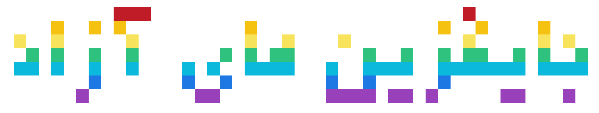

# خانه

 

<h2>به ویکی جایگزین های آزاد خوش آمدید!</h2>
<h3>
با جستجو برای دسته برنامه هایی که میخواهید (مثلا موزیک) یا رفتن به یکی از بخش های ویکی شروع کنید! 😁
</h3>

    
نرم افزار آزاد چیست؟

    

    « نرم‌افزار آزاد» درباره آزادی است، نه قیمت. برای درک بهتر باید به معنای
    «آزاد» در «آزادی بیان» فکر کنید، نه در «آبجو مجانی».
    

    

    نرم‌افزار آزاد در مورد آزادی کاربران برای اجرا، کپی، توزیع، بررسی، تغییر و
    بهبود دادن نرم‌افزار می‌باشد. بطور دقیق‌تر نرم‌افزار آزاد به چهار نوع آزادی
    برای کاربران یک نرم‌افزار اشاره می‌کند:
    

    <ul>
    <li>آزادی برای اجرای برنامه برای هر منظوری (آزادی ۰)</li>
    <li>آزادی برای مطالعه و بررسی چگونگی عملکرد برنامه و تغییر آن برای نیاز خود
    (آزادی ۱). دسترسی به کد منبع یک پیش‌شرط برای این آزادی می‌باشد.
    </li>
    <li>آزادی برای توزیع مجدد کپی‌هایی از آن، بنابراین شما می‌توانید به همسایگان خود
    کمک کنید (آزادی ۲).
    </li>
    <li>آزادی برای بهبود برنامه و انتشار این تغییرات برای عموم، بنابراین تمام جامعه
    از آن بهره می‌برند (آزادی ۳). دسترسی به کد منبع یک پیش‌شرط برای این آزادی
    می‌باشد.
    </li>
    </ul>

    
در صورتی برنامه‌ای یک نرم‌افزار آزاد به شمار می‌آید که کاربران آن همه این
    آزادی‌ها را داشته باشند. بنابراین شما باید برای توزیع مجدد کپی‌هایی از آن،
    خواه با اصلاحات و تغییرات و خواه بدون آن، خواه رایگان و خواه در ازای دریافت
    وجهی، برای هر شخصی و در هر جایی آزاد
    باشید. آزاد بودن برای انجام این کارها (در میان کارهای دیگر) به این معنی است
    که شما مجبور به درخواست و پرداخت هزینه برای مجوز نیستید.
    

    

    شما همچنین باید این آزادی را داشته باشید تا در برنامه تغییراتی ایجاد کنید و
    حتی بدون اشاره به وجود آنها، از آنها بطور خصوصی و برای کار خود استفاده
    کنید. اگر هم تغییرات خود را منتشر کردید، نباید ملزم به اعلام آن به شخص خاص و
    یا به روش خاصی باشید.
    

    <h2><a href="https://www.gnu.org/philosophy/free-sw.fa.html">خواندن ادامه متن در وبسایت گنو...</a></h2>

    
کردیت

    <h3>مشارکت کنندگان این پروژه 
    پروژه <a href="https://github.com/offa/android-foss">offa/android-foss</a>
    </h3>

    
برای انجام

    - اضافه کردن صفحه نحوه مشارکت  
    - تعمیر فایل README نمایش داده شده در صفحه گیت هاب پروژه  

# مشارکت کنندگان

## تاریخچه ستاره ها (:

